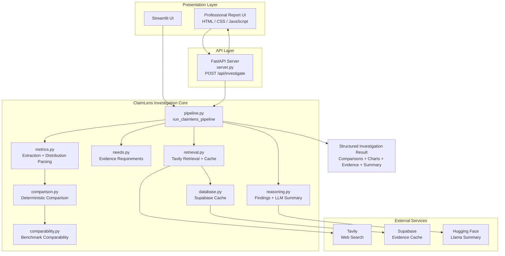

# ClaimLens AI

## AI / ML Reasoning-Based Claim Investigation & Multi-Metric Comparison Engine

**Live Demo:** https://claim-lens-ai-seven.vercel.app/

**GitHub:** https://github.com/BaranikumarNagarajan/ClaimLens-AI

ClaimLens AI is an AI/ML reasoning-based investigation system designed to analyze quantitative claims, compare reported model-evaluation metrics, retrieve supporting evidence, identify metric-level trade-offs, and communicate what can — and cannot — be concluded from the available information.

The central idea is simple:

> **A number can be real without telling the whole story.**

For example, one AI model may report higher accuracy while another reports a higher F1 score. ClaimLens does not force these different metrics into an artificial single score. Instead, it evaluates each metric independently, respects the metric's direction, separates user-provided claims from retrieved evidence, and presents the resulting trade-offs clearly.

---

## 🚀 Live Demo

Try the deployed application:

**https://claim-lens-ai-seven.vercel.app/**

The application allows users to enter AI/ML-related quantitative questions and receive a structured investigation containing:

- Claim interpretation
- Model and metric extraction
- Metric-by-metric comparison
- Evidence retrieval
- Benchmark comparability
- Reasoning and findings
- Limitations
- Source context
- Data-driven visualizations where applicable

---

# 🎯 Project Objective

ClaimLens AI was developed to demonstrate how an AI-assisted reasoning system can investigate **partial quantitative claims** rather than simply accepting a number and producing a conclusion.

The project focuses particularly on AI/ML evaluation claims where metrics such as:

- Accuracy
- Precision
- Recall
- F1 Score
- Specificity
- MAPE
- Benchmark results
- Model outcome distributions

may tell different parts of the story.

The system attempts to answer:

1. What exactly is being claimed?
2. Which models are being compared?
3. Which metrics are being reported?
4. Are those metrics comparable?
5. Which model has the more favorable value for each metric?
6. Are there trade-offs between metrics?
7. Is supporting evidence available?
8. Are retrieved benchmarks actually comparable?
9. What limitations prevent a stronger conclusion?

---

# 🧠 Core Reasoning Principle

ClaimLens follows an important rule:

> **Different evaluation metrics should not automatically be collapsed into one overall score.**

For example:

**Model A**

- Accuracy: 92%
- F1 Score: 88%

**Model B**

- Accuracy: 90%
- F1 Score: 91%

ClaimLens produces:

- Accuracy → Model A is higher by 2 percentage points.
- F1 Score → Model B is higher by 3 percentage points.
- Overall interpretation → The reported metrics show a trade-off.

The system therefore does **not** claim that Model A or Model B is universally superior based only on these two numbers.

A stronger evaluation would require information such as:

- Dataset
- Test split
- Preprocessing
- Class distribution
- Evaluation protocol
- Benchmark definition
- Statistical uncertainty
- Experimental conditions

---

# 🔍 What ClaimLens AI Does

### 1. Claim Extraction

The system identifies models, metrics, numerical values, units, and other relevant information from the user's question.

Example:

```text
Model A has 92% accuracy and 88% F1 score,
while Model B has 90% accuracy and 91% F1 score.
Model A
Accuracy = 92%
F1 = 88%

Model B
Accuracy = 90%
F1 = 91%
```	
2. Metric Normalization

Values are normalized so that comparisons can be performed consistently.

The system also tracks the expected direction of a metric.

Examples:

Accuracy       → higher is better
Precision      → higher is better
Recall         → higher is better
F1 Score       → higher is better
Specificity    → higher is better
MAPE           → lower is better

This prevents the system from treating every numerical difference in the same way.
3. Deterministic Comparison

The comparison engine is rule-based and reproducible.

The LLM does not calculate which number is larger.

Instead, the deterministic comparison engine:

Reads the normalized values.
Applies the metric direction.
Calculates absolute differences.
Determines the more favorable reported value.
Detects equality.
Detects metric-level trade-offs.

This makes the numerical comparison transparent and reproducible.

4. Evidence Retrieval

When appropriate, ClaimLens can retrieve external evidence using the claim, domain, and optional country/market context.

The retrieval layer uses:

Tavily

Retrieved evidence is kept separate from the original user claim.

This distinction is important because:

A value supplied by the user should not automatically be presented as though it came from an external source.

5. Evidence Caching

Retrieved evidence can be cached using:

Supabase

The cache is scoped using normalized:

Question
Market
Domain

This reduces unnecessary repeated retrieval and preserves source-level evidence context.

6. Benchmark Comparability

ClaimLens does not assume that every benchmark result is directly comparable.

Benchmark comparison is shown only when sufficient benchmark information is available from the claim or retrieved evidence.

The system considers whether the comparison has enough contextual information to be meaningful.

7. AI/ML Reasoning

The reasoning layer uses an LLM to help summarize structured findings.

The LLM receives the structured investigation output rather than being responsible for basic numerical calculations.

The reasoning layer can explain:

Metric-level findings
Trade-offs
Evidence status
Benchmark context
Limitations
Overall interpretation

This creates a separation between:

Deterministic computation
        +
Evidence retrieval
        +
LLM-assisted explanation
📊 Example Investigation
User Question
Model A has 92% accuracy and 88% F1 score,
while Model B has 90% accuracy and 91% F1 score.
Which model has the stronger evaluation?
ClaimLens Analysis
Accuracy

Model A = 92%
Model B = 90%

Difference = 2 percentage points

More favorable reported value:
Model A
F1 Score

Model A = 88%
Model B = 91%

Difference = 3 percentage points

More favorable reported value:
Model B
Interpretation
The reported metrics produce a trade-off.

Accuracy favors Model A.
F1 Score favors Model B.

The available values therefore do not establish
one overall model winner.

This is the central reasoning behavior of ClaimLens.

📈 Data Distribution Analysis

ClaimLens can also handle questions containing categorical outcome distributions.

For example:

Model A:
Correct = 35
Partially Correct = 10
Incorrect = 5

The system can reconcile the reported counts and generate structured visualizations such as:

Outcome counts
Outcome shares
Top-two outcomes versus remaining outcomes
Ranked outcome tables

Charts are generated only when sufficient numeric information is available.

The system does not fabricate missing values simply to create a visualization.

🌍 Country-Aware Investigation

ClaimLens supports optional market or country context.

For example:

Country:
Singapore

The country/market can influence evidence retrieval and cache scoping.

This allows a question to contain both:

AI/ML evaluation
+
Geographical context

For example:

Which AI model has better reported accuracy for
Singapore-focused applications?

The system can use the market context during evidence investigation while keeping the original user claim separate from retrieved information.

## 🏗️ Architecture


🔄 Investigation Pipeline

The complete flow can be summarized as:
User Question
      │
      ▼
Claim Extraction
      │
      ▼
Model / Metric Identification
      │
      ▼
Normalization
      │
      ▼
Comparability Analysis
      │
      ├───────────────┐
      ▼               ▼
Claim Comparison   Evidence Retrieval
      │               │
      │               ▼
      │          Evidence Cache
      │               │
      └───────┬───────┘
              ▼
       Structured Findings
              │
              ▼
       AI/ML Reasoning
              │
              ▼
     Final Investigation
              │
              ▼
       UI + Charts + Sources
🧩 Project Structure
ClaimLens-AI/
│
├── app.py
│
├── server.py
│
├── frontend/
│   ├── index.html
│   ├── app.js
│   ├── styles.css
│   └── logo.png
│
├── agent/
│   ├── __init__.py
│   ├── config.py
│   ├── pipeline.py
│   ├── metrics.py
│   ├── comparison.py
│   ├── comparability.py
│   ├── needs.py
│   ├── reasoning.py
│   ├── retrieval.py
│   ├── database.py
│   └── schema.sql
│
├── requirements.txt
├── README.md
└── .gitignore
🛠️ Technology Stack
Programming
Python
Backend
FastAPI
Frontend
HTML
CSS
JavaScript
Alternative UI
Streamlit
AI / LLM
Llama
Hugging Face
Retrieval
Tavily
Database / Cache
Supabase
PostgreSQL
Data / Visualization
Pandas
NumPy
Matplotlib
⚙️ Local Setup

Python 3.11 or newer is recommended.

Using uv:

uv venv

Activate the environment:

.\.venv\Scripts\Activate.ps1

Install dependencies:

uv pip install -r requirements.txt

Create the environment file:

Copy-Item .env.example .env

Then configure the required environment variables in .env.

🔐 Environment Configuration

Typical configuration includes:

TAVILY_API_KEY=
HF_TOKEN=
HF_MODEL=
HF_PROVIDER=
HF_TIMEOUT_SECONDS=

SUPABASE_DB_URL=

SUPABASE_HOST=
SUPABASE_PORT=
SUPABASE_DATABASE=
SUPABASE_USER=
SUPABASE_PASSWORD=

EVIDENCE_CACHE_TTL_DAYS=
EVIDENCE_MAX_RESULTS=

Never commit real API keys or passwords.

The .env file should remain local and should be excluded through .gitignore.

▶️ Running the FastAPI Application

From the project root:

.\.venv\Scripts\python.exe server.py

The local application is available at:

http://127.0.0.1:8600

The main investigation API is:

POST /api/investigate

Example request:

{
    "question": "Model A has 92% accuracy and 88% F1 score, while Model B has 90% accuracy and 91% F1 score. Which model has the stronger evaluation?",
    "market": "Singapore",
    "domain": "AI / ML evaluation"
}

Health endpoint:

GET /api/health
▶️ Running Streamlit

Run:

.\.venv\Scripts\python.exe -m streamlit run app.py

The Streamlit interface uses the same core investigation pipeline.

🔗 Single Pipeline Architecture

Both presentation interfaces use the same pipeline entry point:

agent.pipeline.run_claimlens_pipeline()

This is important because the project does not maintain separate investigation logic for each interface.

The architecture is:

Streamlit UI
     │
     ▼
run_claimlens_pipeline()
     ▲
     │
FastAPI UI

Therefore, the reasoning and comparison behavior remains consistent across interfaces.

📌 Important Design Decisions
No Artificial Overall Score

Accuracy, F1, recall, precision, and other metrics are not automatically combined into one score.

No Fabricated Data

If required numeric observations are missing, the system does not invent values simply to produce a chart.

Claim and Evidence Separation

User-provided numbers remain distinct from externally retrieved numbers.

Deterministic Numerical Reasoning

Basic metric comparison is handled through explicit rules rather than relying on an LLM to perform arithmetic.

Evidence-Aware Reasoning

The final explanation can indicate whether supporting external evidence was available.

Comparability Awareness

The system does not automatically assume that two benchmark numbers represent equivalent experimental conditions.

🧪 Example Questions
Question 1 — Multi-Metric Comparison
Model A has 92% accuracy and 88% F1 score,
while Model B has 90% accuracy and 91% F1 score.
Which model has the stronger evaluation?
Question 2 — Benchmark Comparison
GPT-4, Claude, and Llama report different scores
on an AI benchmark. Which model performs better
and are the benchmark results directly comparable?
Question 3 — Accuracy vs Recall
Model A achieves 95% accuracy and 72% recall,
while Model B achieves 91% accuracy and 89% recall.
What does the comparison actually tell us?
Question 4 — Distribution
Model A completed 50 tasks:
35 correct, 10 partially correct, and 5 incorrect.

Model B completed 50 tasks:
30 correct, 15 partially correct, and 5 incorrect.

Compare the outcome distributions.

🎓 Connection to the Project Theme

ClaimLens AI demonstrates a broader reasoning concept:

Presenting a real number does not necessarily present the complete picture.

An organization, advertisement, benchmark report, or product comparison may highlight one favorable metric while leaving other relevant information outside the main message.

For AI/ML systems, the same issue can occur through:

Accuracy
F1 Score
Recall
Precision
Benchmark Score
Task Success Rate
Outcome Distribution

A model may look better under one measurement and worse under another.

ClaimLens makes this visible by separating the individual measurements and showing the resulting trade-offs.

Therefore, the project can be used as a practical demonstration of how partial quantitative information can influence interpretation.

💡 Why This Project Is Useful

ClaimLens is not intended to replace expert evaluation.

Instead, it provides a structured investigation layer that helps users:

Understand quantitative claims
Identify important metrics
Compare reported values
Detect trade-offs
Retrieve supporting evidence
Check benchmark context
Visualize distributions
Understand limitations
Avoid premature conclusions

The objective is to move from:

"Which number is bigger?"

toward:

"What exactly is being measured,
under what conditions,
and what can we legitimately conclude?"
🚀 Deployment

ClaimLens AI is deployed as a web application.

Live Application

https://claim-lens-ai-seven.vercel.app/

The deployment provides a public interface for demonstrating the investigation workflow without requiring users to run the project locally.

⚠️ Limitations

ClaimLens AI is an investigation and reasoning-support system.

Its conclusions depend on:

Information provided by the user
Quality of retrieved evidence
Availability of comparable benchmarks
Source quality
Metric definitions
Experimental context

A numerical comparison alone cannot establish real-world superiority when the underlying datasets, test conditions, or evaluation protocols differ.

The project therefore intentionally communicates uncertainty and limitations instead of presenting every comparison as a definitive winner.

👨‍💻 Author

Baranikumar Nagarajan

AI/ML | Generative AI | RAG | Agentic AI 

GitHub:

https://github.com/BaranikumarNagarajan

📄 Project Status

Status: Deployed

ClaimLens AI currently provides:

AI/ML claim investigation
Multi-metric comparison
Deterministic metric reasoning
Evidence retrieval
Country-aware retrieval
Benchmark comparability analysis
Evidence caching
LLM-assisted explanation
Outcome distribution analysis
Data-driven visualization
FastAPI interface
Streamlit interface
Public web deployment
ClaimLens AI
Don't just look at the number. Investigate what the number actually tells you.

Save that as **`README.md`**, then run:

```powershell
git add README.md
git commit -m "Update README with live deployment and project documentation"
git push origin main
