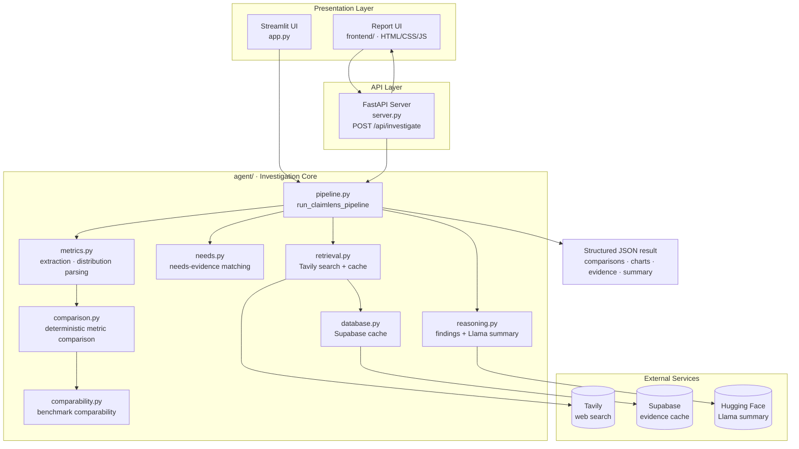

# ClaimLens AI

**AI / ML Reasoning-Based Claim Investigation & Multi-Metric Comparison Engine**

ClaimLens AI investigates quantitative claims, compares reported model-evaluation metrics, identifies metric-level trade-offs, and communicates limitations in conclusions drawn from partial information.

A claim may contain real numbers while still representing only part of an evaluation. For example, one model may report higher accuracy while another reports a higher F1 score. ClaimLens compares each metric independently, respects its direction, and never combines unrelated metrics into an arbitrary overall score.

---

## What It Does

1. **Extracts** reported model and metric values from the claim.
2. **Normalizes** values, tracks physical units, and applies each metric's declared direction.
3. **Retrieves evidence** using the claim, optional market/country, and domain.
4. **Caches** fresh search results in Supabase and deduplicates stored sources.
5. **Compares** reported claim values per metric without combining unrelated metrics.
6. **Reports** source-level evidence context and produces separate, per-metric charts.
7. **Produces** structured reasoning, limitations, retrieval status, and evidence provenance.

## Example

**Input:**

> Model A has 92% accuracy and 88% F1 score, while Model B has 90% accuracy and 91% F1 score.

**Result:**

- Accuracy favors Model A by 2 percentage points.
- F1 score favors Model B by 3 percentage points.
- A metric-level trade-off exists; the reported values do not establish one overall winner.

## Features

- **Deterministic comparison engine** — metric direction, units, and trade-off detection are rule-based and reproducible; the LLM never calculates metric results.
- **User-reported outcome distributions** — parses categorical task-outcome counts (e.g. "Model A - 35 tasks"), reconciles totals, and renders ranked tables plus three charts (counts, share, top-two vs. rest).
- **Evidence comparability gating** — benchmark comparability sections appear only when the claim or a retrieved source names a benchmark.
- **Claim vs. retrieved separation** — user-supplied values and source-reported values are never merged or cross-attributed.
- **Country-aware retrieval** — optional market/country is passed to Tavily as a filter and included in cache scoping.
- **Dual presentation** — a professional FastAPI + HTML/CSS/JS report UI, and a Streamlit UI, both driven by the same pipeline entry point.

## Architecture



`app.py` (Streamlit) and `server.py` (FastAPI report server with the professional frontend in `frontend/`) are presentation-only. Both call the single `agent.pipeline.run_claimlens_pipeline()` entry point. Claim extraction and metric definitions live in `agent/metrics.py`; comparison and reasoning helpers are called by that pipeline. The pipeline also retains its earlier DataFrame fields for callers that use them. The FastAPI server renders Matplotlib charts server-side and returns them to the frontend as base64 PNG images.

## Project Structure

```
app.py                 Streamlit UI (legacy presentation)
server.py              FastAPI report server (port 8600)
frontend/              Professional report UI (HTML/CSS/JS + logo.svg)
agent/
    __init__.py
    config.py          Settings and environment loading
    pipeline.py        Single pipeline entry point
    metrics.py         Metric/model extraction, distribution parsing
    comparison.py      Deterministic per-metric comparison
    comparability.py   Evidence/benchmark comparability assessment
    needs.py           Needs-evidence matching
    reasoning.py       Structured findings + Llama summary
    retrieval.py       Tavily search, cache reuse, normalization
    database.py        Supabase cache access
    schema.sql         Cache table definition
requirements.txt
```

## Setup

Python 3.11 or newer is recommended.

From the repository root in PowerShell:

```powershell
uv venv
.\.venv\Scripts\Activate.ps1
uv pip install -r requirements.txt
Copy-Item .env.example .env
# Edit .env locally to add your keys before running the app.
```

### Run the professional report frontend (FastAPI)

```powershell
.\.venv\Scripts\python.exe server.py
# then open http://127.0.0.1:8600
```

The API endpoint `POST /api/investigate` accepts `{ "question", "market", "domain" }` and returns the full pipeline result as JSON, including charts as base64 PNG images. `GET /api/health` returns a simple status check.

### Run the Streamlit UI

```powershell
.\.venv\Scripts\python.exe -m streamlit run app.py
```

If the virtual environment is already created in another directory, point `uv pip` to it explicitly, for example:

```powershell
uv pip install --python .\.venv\Scripts\python.exe -r requirements.txt
```

## Configuration

Set `TAVILY_API_KEY` to enable web search and `HF_TOKEN` to enable Llama summaries. Set `HF_MODEL` to a model available to your Hugging Face account; the default is `meta-llama/Llama-3.1-8B-Instruct`. The token must have inference permission, and gated model terms must be accepted. `HF_PROVIDER=auto` lets Hugging Face select a provider; set `HF_TIMEOUT_SECONDS` to adjust the request timeout. If the model/provider is unavailable, the app keeps working with its deterministic fallback and shows the reason status.

For Supabase, either provide the full `SUPABASE_DB_URL` connection string or set `SUPABASE_HOST`, `SUPABASE_PORT`, `SUPABASE_DATABASE`, `SUPABASE_USER`, and `SUPABASE_PASSWORD`; the URL takes precedence. A PostgreSQL URL includes username, password, host, port, and database. URL-encode special characters in its username/password.

Before enabling persistent evidence caching, run [`agent/schema.sql`](agent/schema.sql) once in the Supabase SQL Editor. The cache is scoped by normalized question, market, and domain. Successful searches, including empty results, are cached for 30 days by default; adjust `EVIDENCE_CACHE_TTL_DAYS` and `EVIDENCE_MAX_RESULTS` in `.env` if needed. Without a database, live web results can still be analyzed but are not persisted. Without a Tavily key, the app can still compare numbers in the user claim and clearly reports that external search was not performed.

The workspace does not include a `.env` file. Copy the blank example and enter your rotated credentials there. Never commit `.env` or put real credentials in `.env.example`; rotate any credentials that have been exposed.

## Verification

This repository currently has no automated test suite. To check the application manually, run it locally and submit a claim containing at least two models and two metrics. Confirm the country-specific retrieval status, source links, per-metric chart, and database cache status. If there are no numeric observations, the UI reports that a chart cannot be produced instead of fabricating one.

## Author

Built by **Baranikumar Nagarajan** · [GitHub](https://github.com/BaranikumarNagarajan)
